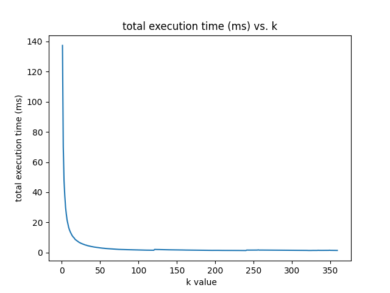
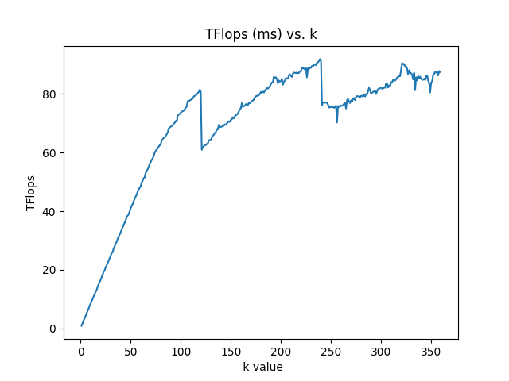
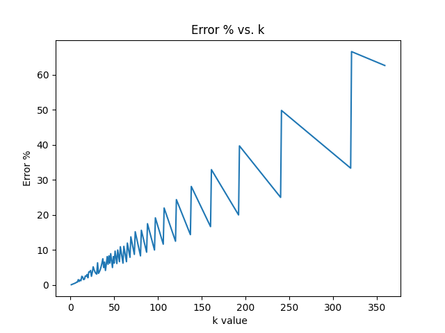

# Project README

## Overview

This project involves performance optimizations to the buffer management and branch divergence handling in the `device_gemm_xdl_streamk.hpp` file. We have also provided scripts for running experiments and plotting the results. Below are the detailed changes and instructions for using the provided scripts.

## Changes Implemented

### Buffer Management
In the file `device_gemm_xdl_streamk.hpp`, we have commented out the buffer management code. This buffer could potentially be removed entirely if it does not affect the accuracy of the computation.

### Minimizing Branch Divergence
We focused on reducing branch divergence in the `block_to_ctile_file`. The original code contained conditional branches based on the value of `blockidx`, which could introduce performance overhead due to branch prediction misses and potential pipeline stalls. We refactored the code to use arithmetic operations instead of conditional statements to minimize these issues.

#### Detailed Explanation:
- **Original Code**: Used conditional branches based on `blockidx`, leading to potential performance overhead.
- **Improved Code**: Refactored to pre-calculate values (`touched_tiles` and `block_idx_contribution`) outside of conditional branches, ensuring these values are computed once, regardless of the branch taken. `current_intersec` is then calculated based on the pre-calculated `touched_tiles`, avoiding redundant computations.

#### Benefits:
- **Reduced Branching Overhead**: Minimizes the likelihood of pipeline stalls due to incorrect branch prediction.
- **Simplified Control Flow**: More straightforward control flow improves compiler optimizations and instruction scheduling.
- **Reduced Redundant Computations**: Avoids repeated computations by pre-calculating values outside of branches.
- **Improved Data Locality**: Simplifies memory access patterns, leading to better cache utilization and fewer memory stalls.

### Experimentation and Scripts
We have included the following scripts for running experiments and plotting the results:
- **pyscript_iteration.py**: Used for iterating through values to test performance.
- **plot_results.py**: Generates plots from the experimental data.
- **submit_job.sh**: Submits jobs for execution.

## Running Experiments

### Experiment Setup
1. **Branch**: All experiments are based on the `ck_streamk_2tile_sk_dp` branch.
2. **SK Block Value**: We iterated the `sk_block` value from 1 to 360 to find the best performing value, concluding that 120 is optimal.
3. **Comparisons**: Compared the current `block_to_ctile` mapping to a pure data parallelism approach, finding that data parallelism was faster due to better matching of output tiles to CUs*occupancy.

### Tools
- **rocprof**: Used for profiling.
- **perfetto**: Used for visualization.

### Findings
- An asynchronous memory initialization step before launching the kernel could potentially be removed.
- Removing the buffer did not affect accuracy but resulted in a slight performance increase.
- Optimization efforts focused on `block_to_ctile` mapping and minimizing branch divergence.

## Experimental Results
We used the `ck` library and the `ck_streamk_2tile_sk_dp` branch with `sk_block` set to 120 as the baseline. The metrics were collected by running the kernel 10 times (5 warm-up + 5 testing) and averaging the results of the last 5 runs.

| Metric              | Original | Buffer Removed | Min Branch Divergence | Combined |
|---------------------|----------|----------------|-----------------------|----------|
| Execution time (ms) | 1.6352   | 1.5941         | 1.6143                | 1.5922   |

## Conclusion
The optimized code surpasses the baseline by reducing execution steps and minimizing branch divergence, resulting in slight performance improvements.

## How to Run
1. **Run Experiments**: Use `submit_job.sh` to submit jobs for execution.
   ```bash
   ./submit_job.sh

2. **Iterate Values**: Use `pyscript_iteration.py` to iterate through test values.
    ```bash
    python pyscript_iteration.py

3. **Plot Results**: Use `plot_results.py` to generate plots.
    ```bash
    python plot_results.py

Here are sample plots: 
<p align="center">
  
  
  
</p>


### Future Work

Further optimization of the block_to_ctile mapping.
Exploration of additional ways to reduce branch divergence and improve performance.